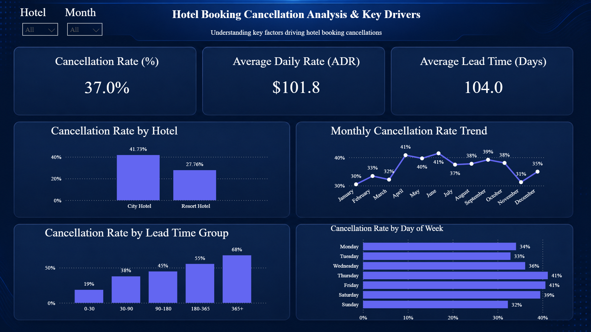

# Hotel Booking Cancellation Analysis

## 📊 Overview

This project analyzes hotel booking data to identify key factors driving cancellations.
The analysis includes data cleaning, feature engineering, and an interactive Power BI dashboard.

---

##  Objectives

* Analyze cancellation patterns
* Identify key drivers of cancellations
* Build an interactive dashboard for insights

---

##  Dataset

* Hotel booking dataset (cleaned using Python)
* Includes features such as:

  * Lead time
  * ADR (Average Daily Rate)
  * Hotel type
  * Booking dates

---

##  Tools Used

* Python (Pandas, NumPy)
* Power BI
* Jupyter Notebook

---

##  Key Insights

*  **Lead Time is the strongest predictor**

  * Cancellations increase from **19% (0–30 days)** to **68% (365+ days)**

*  **City Hotels have higher cancellation rates**

  * ~42% vs ~28% for resort hotels

*  **Seasonal patterns exist**

  * Higher cancellations in mid-year months

*  **Weekly trends**

  * Higher cancellations towards the end of the week

---

##  Dashboard Preview

---

##  Outcome

Built an end-to-end data project including:

* Data cleaning
* Feature engineering
* Exploratory analysis
* Interactive dashboard

